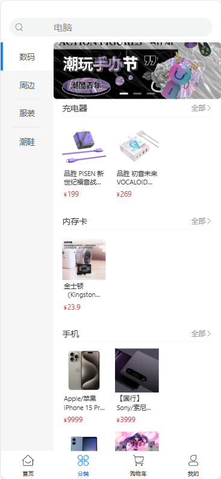

# 小帆购物

### 后端地址：https://gitee.com/LiFan2004/xiaofan-shopping-service
### 后台地址：https://gitee.com/LiFan2004/xiaofan-mall-shopping-background

## 介绍

小帆购物是一款基于UniApp开发的移动端在线购物商城项目。它充分利用了UniApp的跨平台能力，为用户提供流畅、便捷的购物体验。无论您是在iOS还是Android设备上，都能享受到一致且高质量的购物服务。

## 软件架构

本项目采用模块化、组件化的软件架构，以提高代码的可维护性和可扩展性。前端部分基于Vue 3和UniApp框架开发，后端使用Node.js，Redis，Mysql等技术栈通过API接口实现前后端的数据交互，确保数据的实时性和准确性。

## 安装教程

1. **安装Node.js和npm**：  
   在本地计算机上安装Node.js和npm（Node Package Manager），这是运行和构建UniApp项目所必需的。
> 使用pnpm指令安装依赖
2. 项目运行H5：npm run dev:h5

# 小帆购物使用说明与技术栈

## 使用说明

### 浏览商品
- 在首页或分类页面中，您可以浏览各种商品。
- 通过点击商品，进入商品详情页查看该商品的详细信息。

### 加入购物车
- 在商品详情页中，选择您需要的商品规格和数量。
- 点击“加入购物车”按钮，将商品添加到购物车中。
- 购物车页面将显示您已选中的商品及其总价。

### 提交订单
- 在购物车页面中，确认您的订单信息。
- 点击“提交订单”按钮，系统将引导您完成支付流程。
- 支付成功后，系统将生成订单记录。

### 查看订单
- 在“我的订单”页面中，您可以查看所有已提交的订单。
- 订单状态包括待支付、已支付、已发货等，方便您随时跟踪订单状态。

### 个人中心
- 在个人中心页面中，您可以管理您的个人信息。
- 包括收货地址、优惠券等信息的添加、编辑和删除。

## 技术栈

### 前端
- **UniApp**：用于构建跨平台的移动端应用。
- **Vue 3**：作为前端框架，提供响应式的数据绑定和组件化开发。
- **Pinia**：Vue 3的状态管理库，用于管理全局状态。
- **Pinia-plugin-persistedstate**：持久化Pinia状态，确保用户数据不丢失。
- **Axios**：用于发起HTTP请求，与后端API接口进行数据交互。
- **Vue-i18n**：实现应用的国际化，支持多语言切换，提升用户体验。

### 后端
- 使用**Node.js**、**Express**、**Mysql**、**Redis**等技术栈。
- 数据库**MySQL**用于存储商品、订单等数据，确保数据的安全性和可靠性。

## 页面展示

